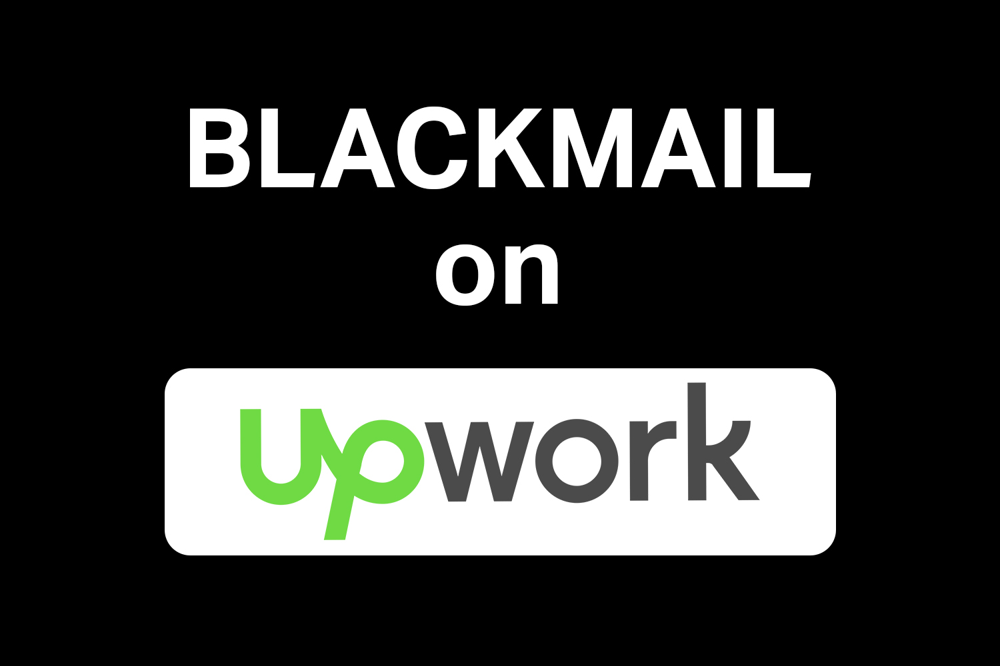

Yesterday I spent the day dealing with a horrible client I had from UpWork

They got me stuck working on the frontend without providing any backend endpoints. Dumped some Figma designs and then kept complaining that the site I am building is not fully functional and only serves dummy data. As someone who has experience in backend I know that what I needed didn't require all that much work and even as I am writing this - I cannot believe that I actually had to beg for endpoints🤦

Their backend developer who is sadly their CTO, was all talk but no actual work, and he not only refused to collaborate but also criticized everything that I am doing - every step I am taking in the process. A failed build which is fixed in seconds by simply increasing the budget limits in angular.json, was turned into a huge issue. Reminded me of a guy in my first job who made a huge deal out of a merge conflict (that he deliberately caused) - which is not something that worries an experienced developer, since we know that things like this happen from time to time, and most importantly we how to easily fix it in no time, and move on.

But yeah every time I asked this CTO guy to provide what I needed to advance, or to collaborate normally by actually doing something - he instead just turned around and pointed out something that I must fix. Maybe he was thinking that he was throwing curve balls at me, expecting those things to take me longer to fix, but I kept fixing everything that the pointed out and we kept coming back to the actual problem - no endpoints.

I pretty much ended the contract because of him. I said that I am happy to find a replacement and I assured them that I can handover the project to the next frontend developer free of charge. They did not take that offer - instead they were forcing me to speak to the CTO - yeah same guy who did not collaborate and only blamed me for things. So I made it clear that if I am going to be speaking to that guy (knowing exactly how the conversation will go) - I expect to be fairly compensated since I am not going to put myself through that for free.

After I ended the contract with them, they requested a full refund for absolutely everything, spewed many lies including saying that I refused to handover the project and much more. So at this point I am assuming that this was their intention all along - to just find a reason to not pay and get some work done for free.

I actually went out of my way to get them a good replacement, was honest with them instead of BSing for months - which we know some developers do. They first took the recommendations I provided and then requested the refund. As if that was not enough - they decided to leave me a horrible review full of lies, and they used the bad review to blackmail me into giving them the refund.

But that was yesterday, today is a bright new day, so what's up on the internet... Oh yea here is - DEVIN 🤦

#webdevelopment #upwork #freelance #softwareengineering #devinai

